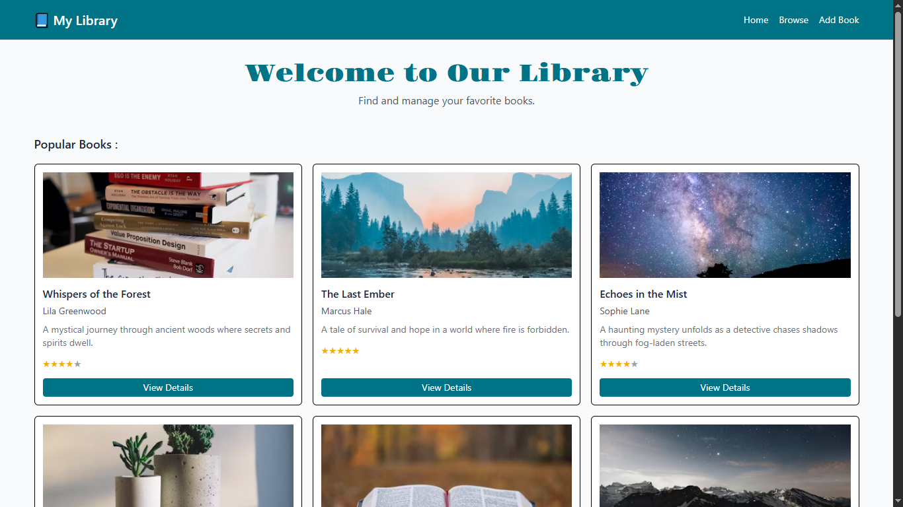
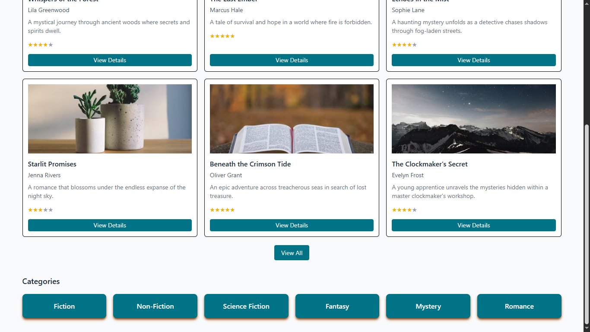
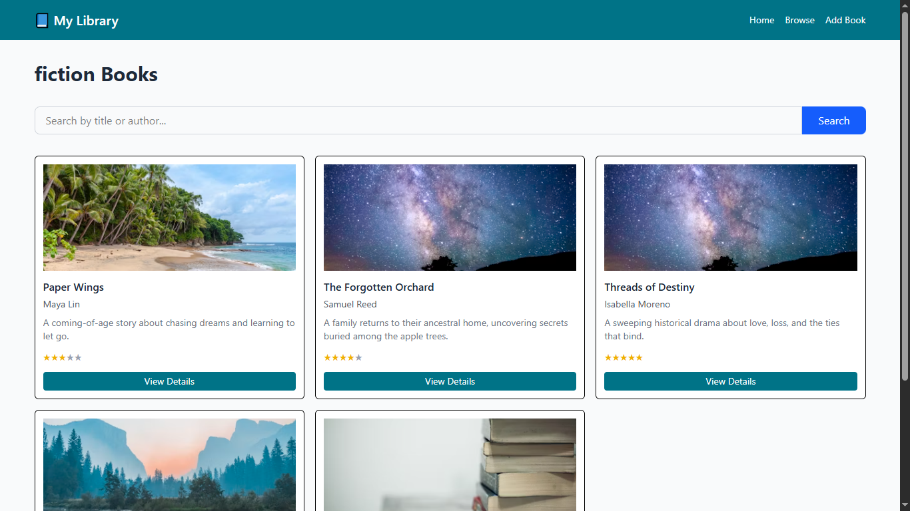
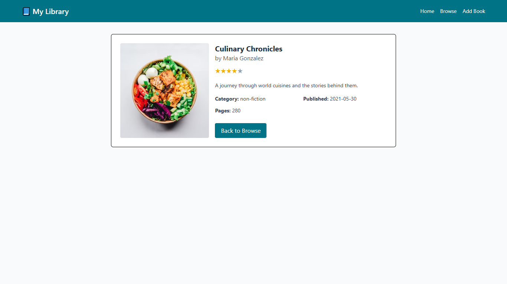
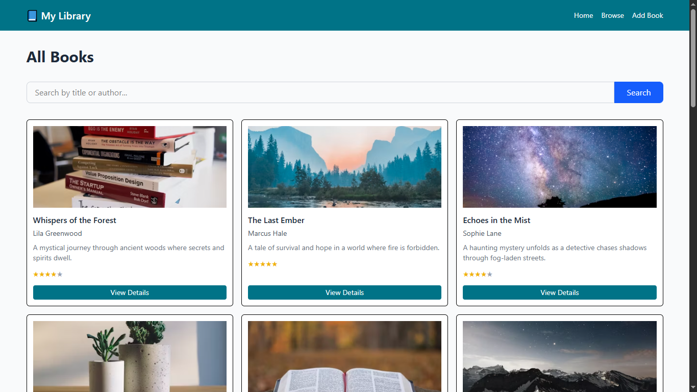
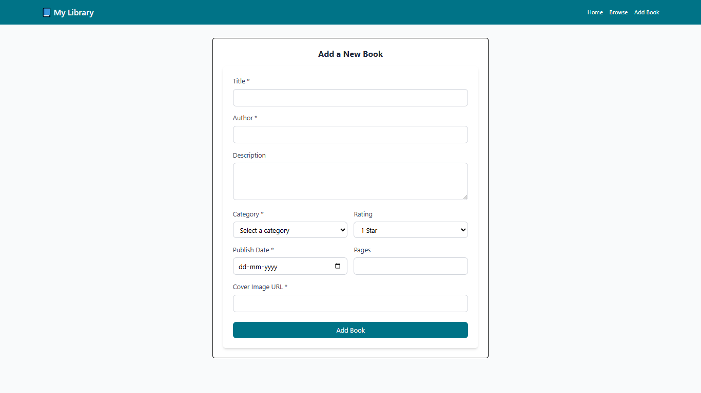

# 📚 Online Library System (React + Redux + Tailwind CSS)

A simple and functional **Online Library System** built using **React**, **Vite**, **Tailwind CSS**, and **Redux Toolkit**. It allows users to browse, search, and add books — all within a clean beginner-style UI.

---

## 🖼️ Project Preview

---

## 🏠 Homepage 


---

## 🏷️ Categories 


---

## 🏷️ Category 


---

## 📖 Book Details


---

## 📚 Browse books 


---

## ➕ Add Book


---


## 🚀 Features

- View all books
- Browse by category
- Search by title or author
- View book details
- Add new books
- Error page for invalid routes
- Redux Toolkit for state management
- Tailwind CSS for styling

---

## 🛠️ Tech Stack

- [React](https://reactjs.org/)
- [Vite](https://vitejs.dev/)
- [Tailwind CSS](https://tailwindcss.com/)
- [Redux Toolkit](https://redux-toolkit.js.org/)
- [React Router](https://reactrouter.com/)

---

## 📁 Folder Structure

```
📦online-library-system
 ┣ 📂node_modules/
 ┣ 📂public/
 ┣ 📂src/
 ┃ ┣ 📂assets/
 ┃ ┣ 📂Components/
 ┃ ┃ ┣ 📄Book.jsx
 ┃ ┃ ┣ 📄BookDetails.jsx
 ┃ ┃ ┣ 📄BookForm.jsx
 ┃ ┃ ┣ 📄BookList.jsx
 ┃ ┃ ┣ 📄CategoryList.jsx
 ┃ ┃ ┣ 📄Error.jsx
 ┃ ┃ ┣ 📄Header.jsx
 ┃ ┃ ┣ 📄Home.jsx
 ┃ ┃ ┗ 📄SearchBooks.jsx
 ┃ ┣ 📂pages/
 ┃ ┃ ┣ 📄AddBook.jsx
 ┃ ┃ ┗ 📄BrowseBooks.jsx
 ┃ ┣ 📂redux/
 ┃ ┃ ┣ 📄bookSlice.js
 ┃ ┃ ┗ 📄store.js
 ┃ ┣ 📂Utils/
 ┃ ┃ ┗ 📄mockdata.js
 ┃ ┣ 📄App.jsx
 ┃ ┣ 📄App.css
 ┃ ┣ 📄main.jsx
 ┃ ┣ 📄index.css
 ┃ ┗ 📄vite.config.js
 ┣ 📄.gitignore
 ┣ 📄package.json
 ┣ 📄package-lock.json
```

---

## 💻 How to Run Locally

1. **Clone the repo**
```bash
git clone https://github.com/RohitPalekar/Online_Library_System.git
cd online-library-system
```

2. **Install dependencies**
```bash
npm install
```

3. **Run the dev server**
```bash
npm run dev
```

4. Visit: [http://localhost:5173](http://localhost:5173)

---

## 🧠 Tips

- Use the category tabs to filter books
- Type in the search bar to filter by title/author
- Visit invalid URLs to trigger the 404 page
- Add books using the form on `/add`

---
